# Star Mall

基于SpringBoot + Vue的仿淘宝商城项目，涵盖商品、购物车、订单、优惠券、客服等多个模块

## 项目背景

虽然商城项目已经烂大街了，但在准备求职项目的时候还是选择了商城，主要是基于以下两点：

第一，商城系统的业务逻辑相对复杂，能够学到的业务，能够应用的技术比较多。

第二，市面上已有淘宝、京东等成熟的商城系统，有现成的案例可供学习。

本项目就是仿照着淘宝进行开发的，希望能够学习到淘宝的业务逻辑，复现淘宝的功能。

目前搭建好了整体的框架，实现了大部分功能，但还有很多需要完善和优化的地方，后续会不断更新。

## 技术栈

后端：JDK17 +  SpringBoot3  +  MyBatis-plus  + MySql + Redis + RabbitMq + ElasticSearch  

前端：Vue3

## 页面预览

首页：

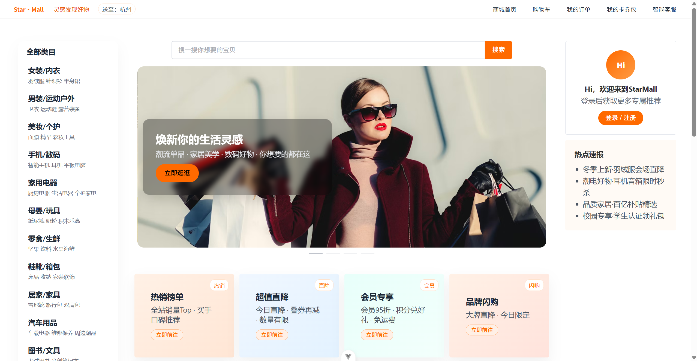

登录页：

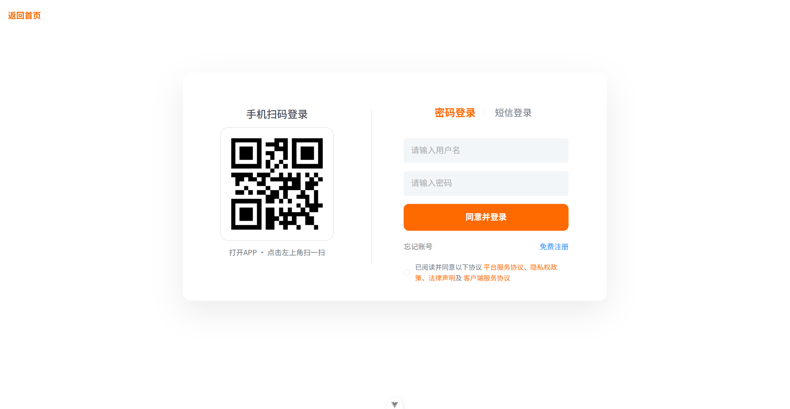

注册页：

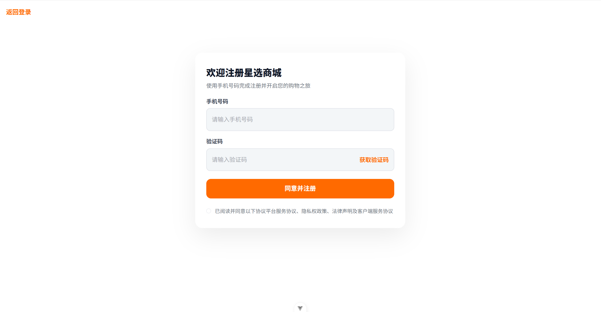

商品搜索页：

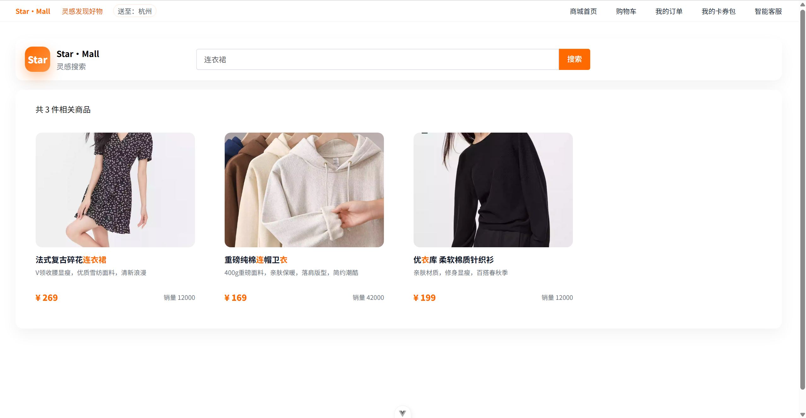

商品详情页：

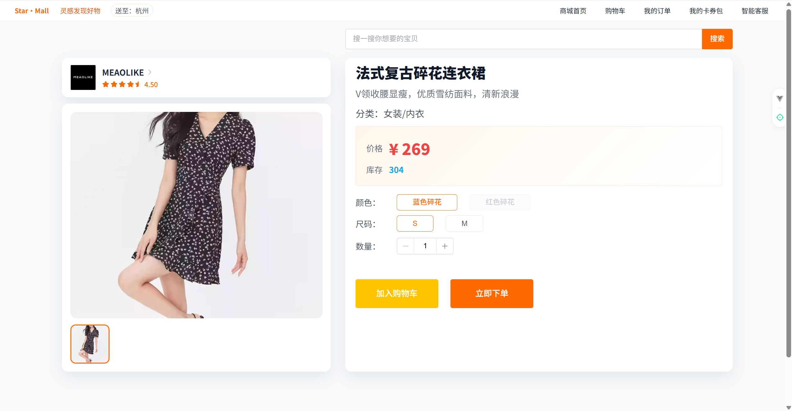

订单确认页：

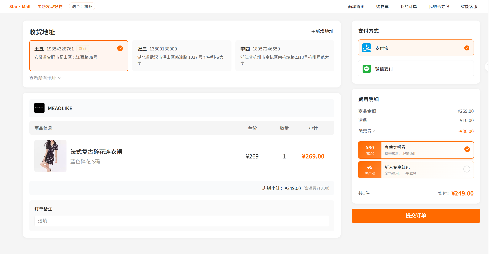

购物车页：

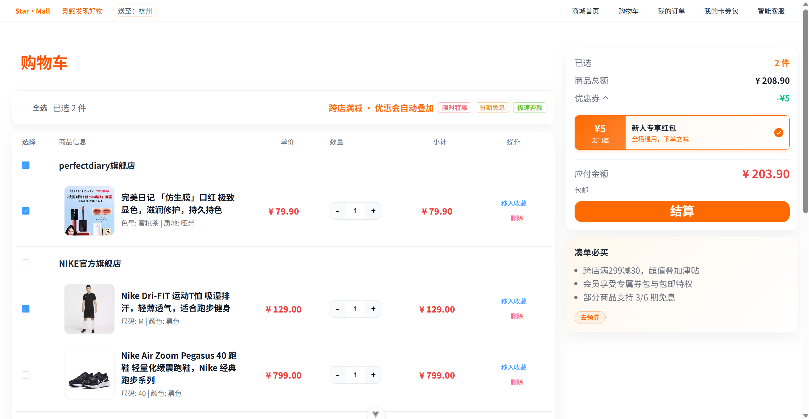

订单中心页：

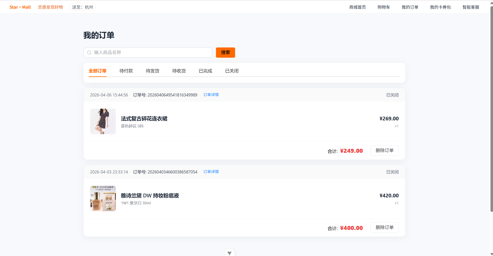

我的优惠券页：

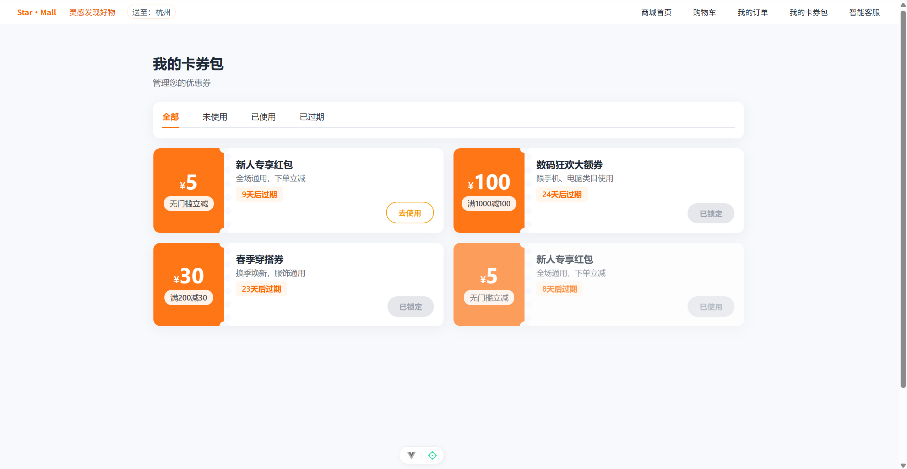

领券中心页：

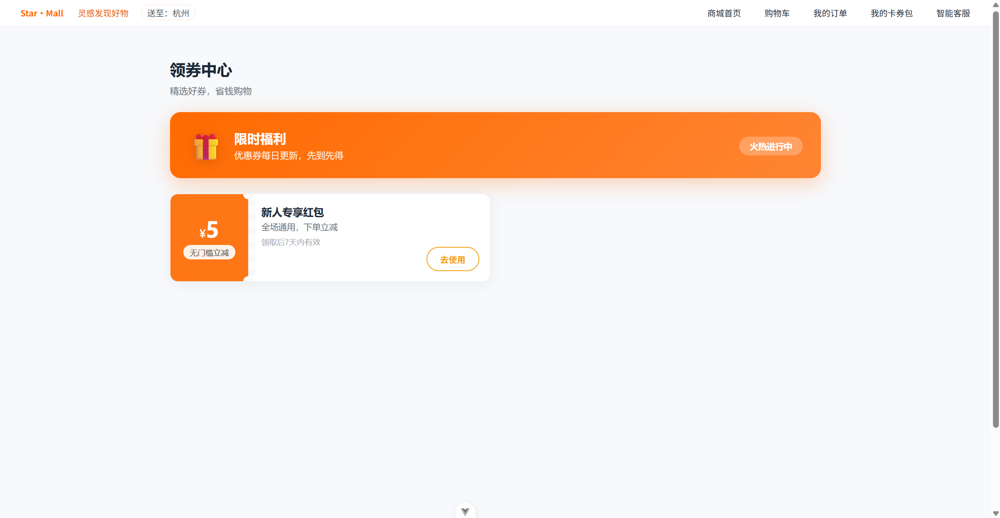

## 接口预览

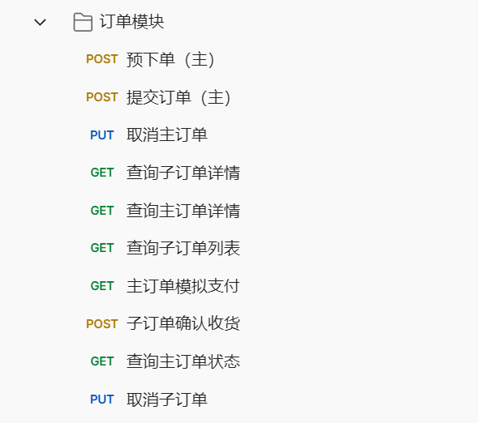

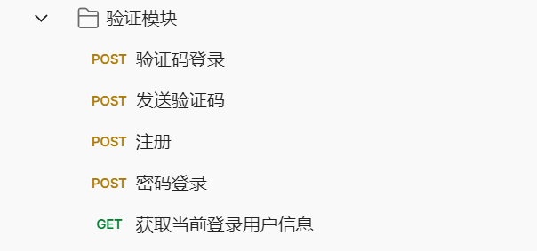

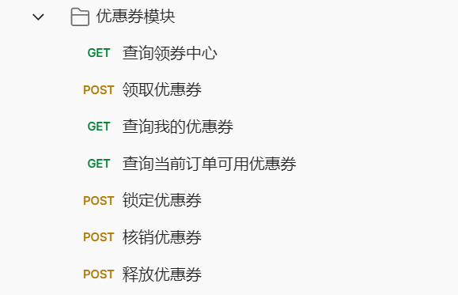

​						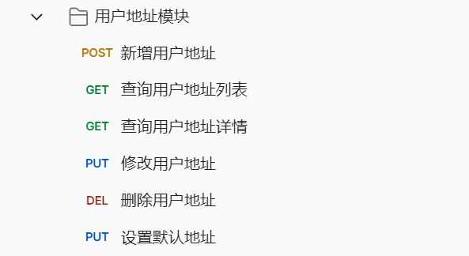